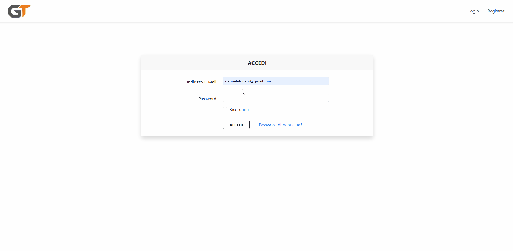

# Portfolio Dashboard (Laravel)

Questo progetto costituisce l'anima gestionale del mio portfolio personale. Si tratta di un'applicazione **Laravel** che integra un'area amministrativa privata per il controllo totale dei contenuti e un set di **API REST** per la comunicazione con il frontend.

### Demo

### Tecnologie utilizzate

* **Laravel**
* **Architettura CRUD Completa**
* **Eloquent ORM**
* **API RESTful**
* **Storage**
* **Blade & Bootstrap**
